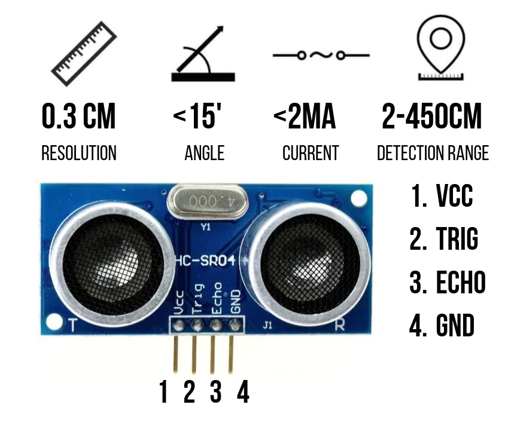

# Readme

This repo holds code for an ultrasonic Water level sensor designed for my cistern.

It uses an HC SR04 ultrasonic sensor purchased on amazon and an esp32 to send MQTT information to my HomeAssistant dashboard.

HC SR04

